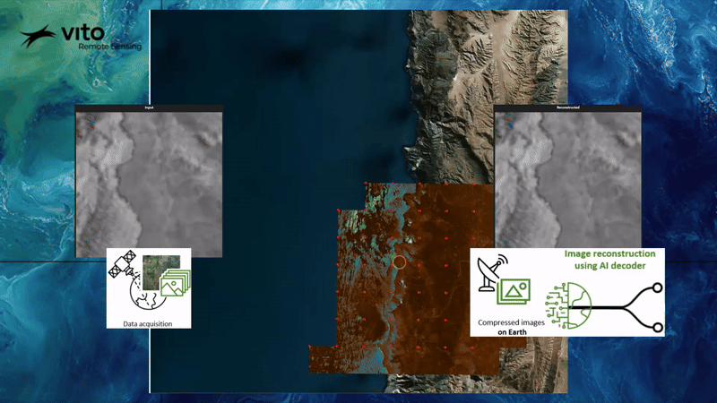

# CORSA

Revolutionizing EO with AI-driven Data Compression
Developed by VITO Remote Sensing, CORSA revolutionizes data compression and processing for Earth Observation.
Using advanced deep learning, it efficiently compresses imagery from sensors like Sentinel-1, Sentinel-2 and PRISMA, drastically reducing data volume while maintaining high image fidelity, even at 100x compression rates.

CORSA's flexibility offers tailored solutions, balancing compression ratio and reconstruction quality to meet specific project needs. It provides custom trained models for new sensors, pretrained models for optimizing EO portal storage, and AI training templates for downstream applications. 
CORSA's compressed features can be directly used to build downstream applications, enhancing the development and accessibility of hyperspectral application despite data transmission limitations. 

This technology enhances efficiency and reduces costs for space providers and space agencies.
CORSA paves the way for advanced AI in future space missions and will expand into hyperspectral data analyses, broadening its impact across EO sectors.

### Useful links
- https://remotesensing.vito.be/services/corsa
- https://blog.vito.be/remotesensing/corsa
- https://remotesensing.vito.be/